# AI/ML Engineering — Diagram Gallery Index

89 diagrams, grouped by course / topic. Regenerate with `python diagrams/generate_gallery.py`; integrity review: `python diagrams/verify_diagrams.py`.

## LLM Course — internals, training, inference (diagrams/llm/)

| Diagram | Description |
|---------|-------------|
|  `kv_cache.png` 939x639 | O(T^2) full recompute vs O(T) cached decoding, annotated with measured speedups (2.4x @ T=128 ... 11x @ T=768) |
|  `kv_cache_memory.png` 917x591 | KV cache memory growth: ~0.5 MiB/token => 2 GiB @ 4k, 64 GiB @ 128k context |
|  `llm_architecture.png` 1004x1057 | Decoder-only GPT stack: token embeddings -> RoPE -> N blocks (RMSNorm, MHA, SwiGLU FFN) -> final norm -> LM head -> sampling |
|  `lora.png` 1167x648 | W' = W + (alpha/r) B A: adapter low-rank decomposition with the verified 48x trainable-parameter reduction |
|  `prefill_decode.png` 1595x610 | Prefill phase (parallel, compute-bound) vs decode phase (one token at a time, memory-bandwidth-bound) |
|  `pretraining_pipeline.png` 1764x554 | Raw data -> filter -> clean -> dedup -> tokenize -> pack -> shuffle -> batch -> train -> validate -> checkpoint |
|  `quantization.png` 917x618 | 7B model memory: FP32 28 GB -> FP16/BF16 14 GB -> INT8 7 GB -> INT4 3.5 GB |
|  `sampling.png` 1595x610 | Temperature reshaping of logits [2, 1, 0.1] (T=0.1 sharp, T=1.0, T=2.0 flat), top-k and top-p truncation |
|  `scaling_laws.png` 1171x639 | REAL lab sweep: val loss 2.723 (S) -> 2.617 (M) -> 2.421 (L) vs bigram 2.763; ppl 15.2/13.7/11.3 |
|  `speculative_decoding.png` 1275x583 | Draft (gamma tokens) -> verify in parallel -> accept/reject -> resample: ~2.6x fewer forwards |

## GenAI + Agents Course — RAG agents, multi-agent, bench (diagrams/agents/)

| Diagram | Description |
|---------|-------------|
|  `agent_loop.png` 1167x756 | Observe -> reason -> act (tool call) -> observe result -> repeat until final answer; tool registry + safety guards |
|  `embedding_bench.png` 1594x609 | REAL lab numbers: dense 9/9 vs lexical 6/9 hit@1; paraphrases 6/6 vs 4/6; HF MiniLM matches local SVD |
| 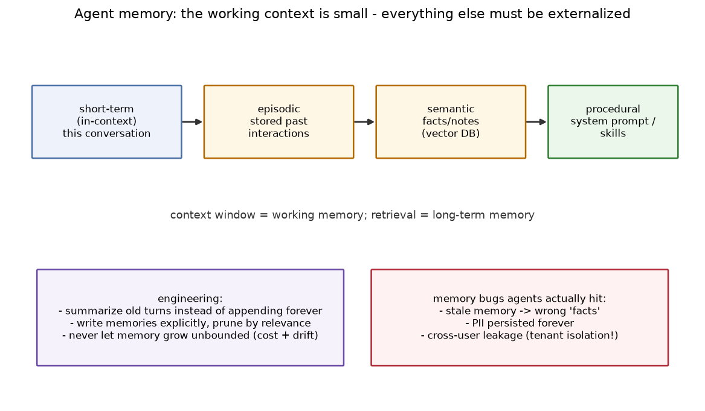 `memory_types.png` 1167x681 | — |
|  `multi_agent.png` 1221x756 | Supervisor pattern: supervisor routes to writer / reviewer / researcher specialists, results return to supervisor |
|  `prod_rag_server.png` 1329x775 | Production RAG server: auth/RBAC -> per-key quota -> Redis-style cache -> RAG brain -> SQL request log |
|  `rag_agent.png` 1406x734 | RAG agent: query -> retrieve -> ground -> generate with citations; tool calls for calculator/retrieval; injection guard |
| 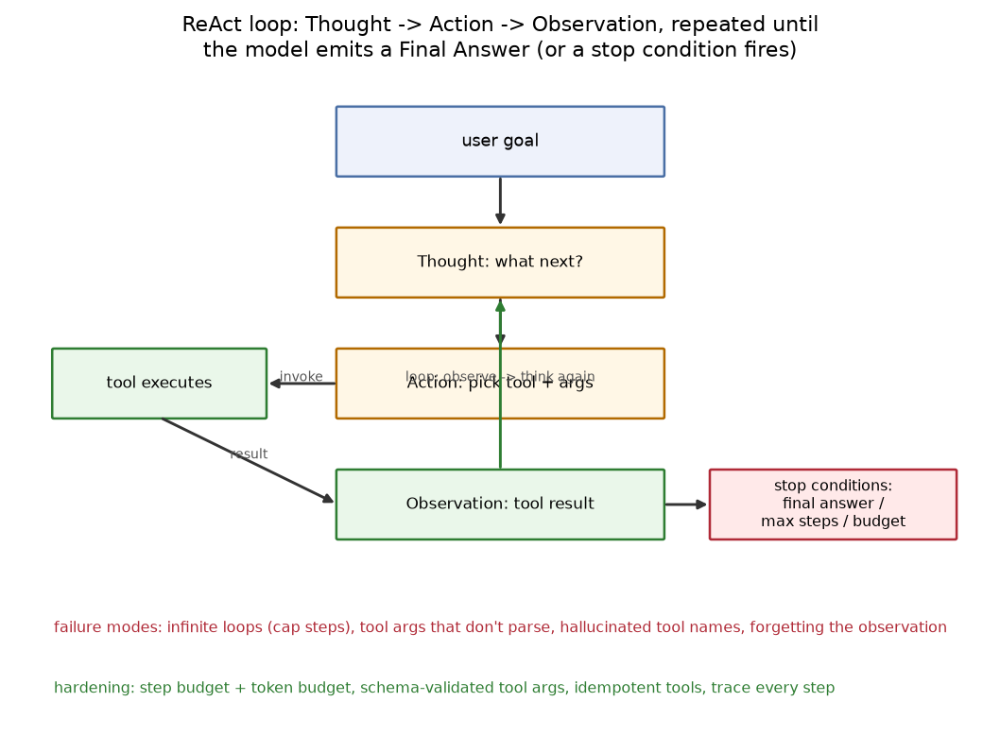 `react_loop.png` 1058x797 | — |

## ML Course — lifecycle + model diagnostics (diagrams/ml/)

| Diagram | Description |
|---------|-------------|
|  `confusion_matrix.jpg` 922x885 | TP/TN/FP/FN layout with derived metrics (accuracy, precision, recall, F1) |
|  `cross_validation.jpg` 1785x734 | K-fold CV: fold rotation, train/validation blocks per fold |
|  `decision_boundary.jpg` 1184x884 | Classifier decision boundary vs data points (linear and non-linear) |
|  `feature_importance.png` 1046x637 | Permutation / tree-based feature importance ranking with drop-off |
|  `imbalance.png` 1469x637 | Class imbalance: skewed distribution + SMOTE oversampling of the minority class |
|  `kmeans.png` 1418x637 | K-means iterations: centroids moving, assignments updating, convergence on the objective |
|  `learning_curves.png` 923x639 | Train vs validation error as training set grows: high-variance (gap) vs high-bias (plateau) diagnosis |
|  `ml_lifecycle.png` 1764x576 | Full ML lifecycle: data -> EDA -> features -> train/val/test -> baseline -> model -> tune -> deploy -> monitor -> drift -> retrain (closed loop) |
|  `ml_workflow.jpg` 2385x885 | End-to-end ML workflow diagram (data -> modeling -> evaluation -> deployment) |
|  `model_comparison.jpg` 1785x1035 | Model comparison: accuracy/latency/size trade-offs |
| 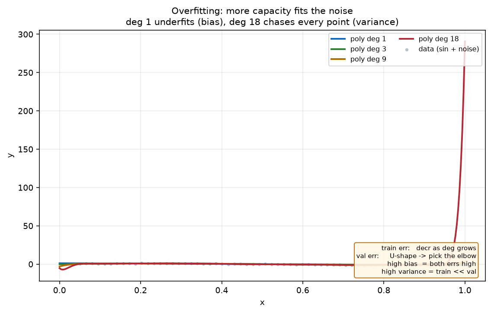 `overfit_gap.png` 1135x726 | Capacity sweep deg 1/3/9/18 on noisy sine: underfit (bias) -> good -> chasing noise (variance), with train/val U-shape inset |
|  `overfitting.jpg` 1485x884 | Overfitting vs underfitting vs good fit curves |
|  `pca.png` 1524x638 | PCA projection: data cloud, first principal component direction, explained-variance scree |
|  `pr_curve.png` 923x637 | Precision-recall curve with baseline and trade-off regions (for imbalanced classes) |
|  `roc_curve.jpg` 1184x884 | ROC curve with AUC annotation |
|  `test.jpg` 1200x900 | Train / validation / test split with leakage warning |
|  `time_series.png` 1029x637 | Trend + seasonality decomposition with forecast over the historical series |

## Mathematics (diagrams/math/)

| Diagram | Description |
|---------|-------------|
|  `bias_variance.jpg` 1484x884 | Bias-variance decomposition: low/high bias x low/high variance quadrants |
| 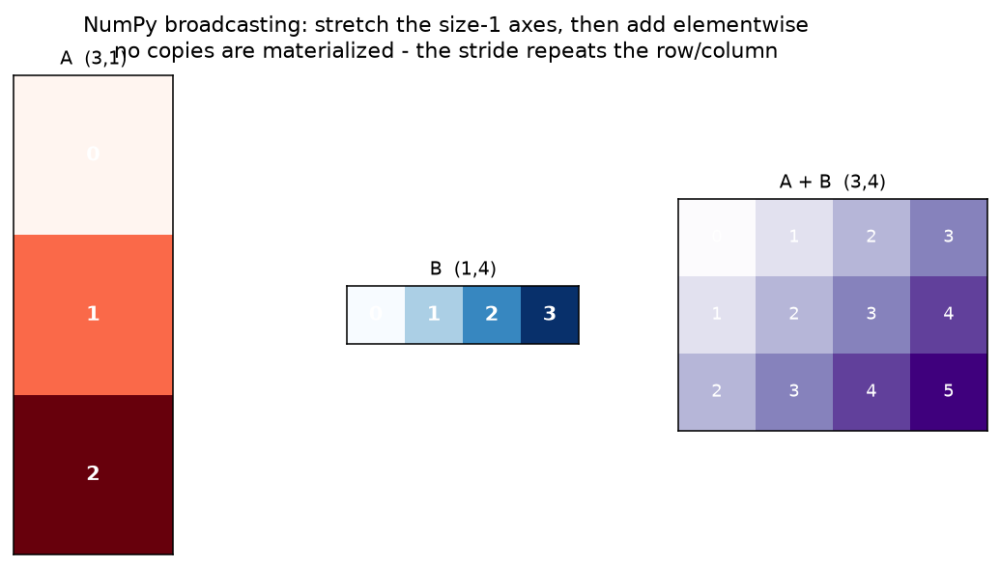 `broadcasting.png` 1035x588 | NumPy broadcasting: (3,1) + (1,4) -> (3,4): size-1 axes stretch (stride repeat, no copy) then elementwise add |
|  `entropy_gini.jpg` 2085x734 | Entropy and Gini impurity as functions of class probability |
|  `gradient_descent.jpg` 1484x1185 | Gradient descent: cost surface, steps to minimum, learning-rate effect |
|  `sigmoid.jpg` 1484x884 | Sigmoid curve with its derivative |

## Deep Learning (diagrams/dl/)

| Diagram | Description |
|---------|-------------|
|  `activation_functions.jpg` 1784x1522 | Sigmoid / tanh / ReLU / GELU / SiLU curves with derivative behavior |
|  `backpropagation.jpg` 2085x734 | Backpropagation flow: forward pass, loss, gradients flowing backward through the graph |
|  `cnn_architecture.jpg` 2085x734 | CNN stack: conv -> pool -> conv -> pool -> flatten -> dense |
|  `gradient_descent.jpg` 2233x772 | Neural-net gradient descent: loss landscape and optimization path |
|  `lstm_gates.jpg` 2085x884 | LSTM cell: forget / input / output gates and cell-state highway |
|  `neural_network.jpg` 1485x1034 | MLP: input -> hidden layers -> output with weights and activations |

## Backend / APIs (diagrams/backend/)

| Diagram | Description |
|---------|-------------|
|  `api_flow.jpg` 2085x734 | API request flow: client -> route -> validation -> service -> response |
|  `backend_architecture.jpg` 2085x1184 | Backend architecture: FastAPI, DB, cache, workers |

## NLP (diagrams/nlp/)

| Diagram | Description |
|---------|-------------|
|  `nlp_pipeline.jpg` 2385x734 | NLP pipeline: raw text -> clean -> tokenize -> features -> model |
|  `sentiment_analysis.jpg` 1482x884 | Sentiment classification flow with example scores |
| 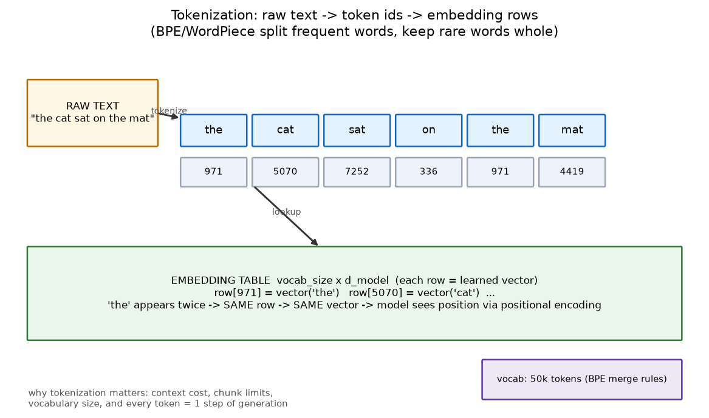 `tokenization.png` 1167x689 | Tokenization: raw text -> BPE/WordPiece tokens -> vocab ids -> embedding-table rows (repeated words share a row; position comes from positional encoding) |
|  `word_embeddings.jpg` 1485x1185 | Word embeddings: high-dim one-hot to dense vector space with similar words near each other |

## RAG (diagrams/rag/)

| Diagram | Description |
|---------|-------------|
| 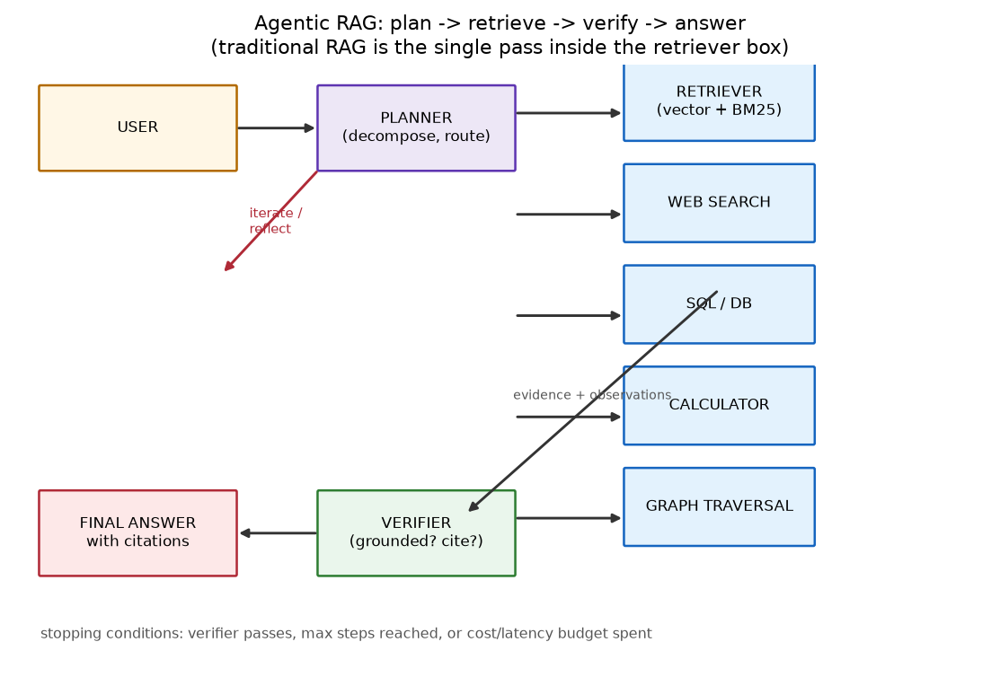 `agentic_rag.png` 1113x754 | Agentic RAG: planner routes to retriever / web search / SQL / calculator / graph tools, verifier grounds + cites, loop with stopping conditions |
| 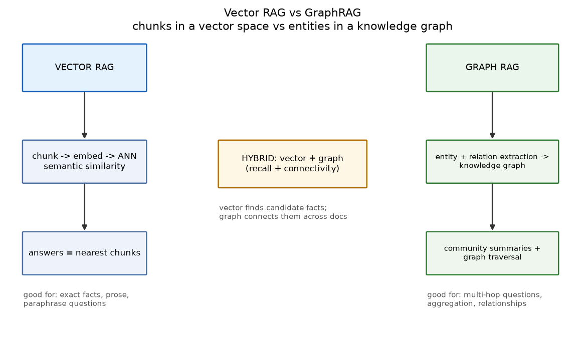 `graph_vs_vector_rag.png` 1167x689 | Vector RAG (chunk -> embed -> ANN) vs GraphRAG (entity/relation extraction -> knowledge graph -> community summaries) vs hybrid |
| 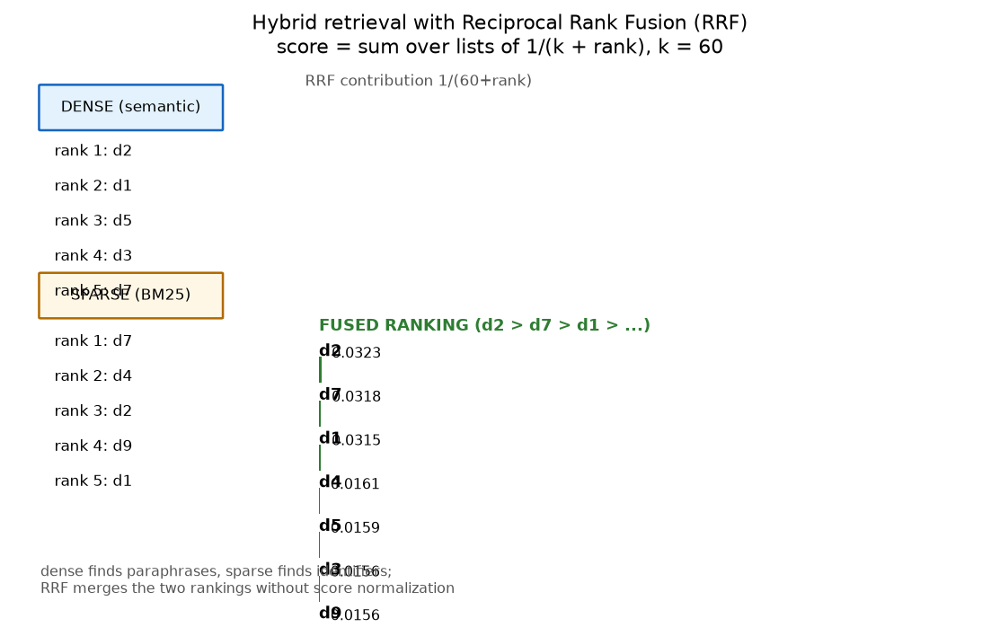 `hybrid_rrf.png` 1113x708 | Hybrid retrieval with RRF: dense + BM25 rank lists fused by 1/(k+rank), k=60, worked example with fused ranking |
| 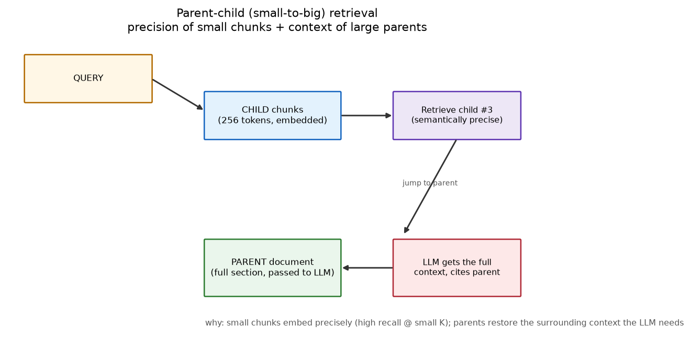 `parent_child.png` 1320x667 | Parent-child (small-to-big) retrieval: precise child chunks embedded, retrieve child, return parent context to the LLM |
| 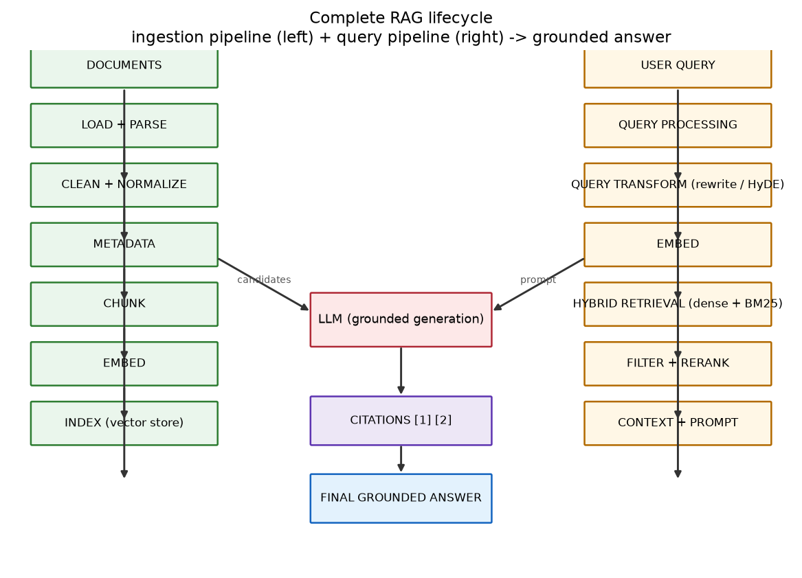 `rag_lifecycle.png` 1167x842 | Complete RAG lifecycle: ingestion column (load/parse/clean/chunk/embed/index) + query column (process/transform/hybrid retrieve/rerank/prompt) meeting at the grounded LLM with citations |
| 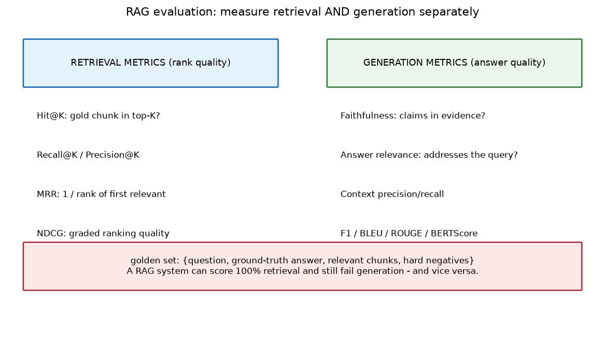 `rag_metrics.png` 1167x681 | RAG evaluation split: retrieval metrics (Hit@K, Recall@K, MRR, NDCG) vs generation metrics (faithfulness, relevance, F1/BLEU/ROUGE/BERTScore) |
|  `rag_pipeline.jpg` 2385x884 | RAG pipeline: documents -> chunk -> embed -> vector DB -> retrieve -> LLM -> grounded answer |
|  `rag_vs_finetuning.jpg` 2085x885 | RAG vs fine-tuning comparison: knowledge updates, cost, hallucination |
| 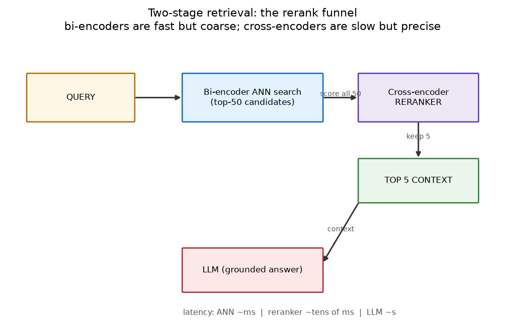 `rerank_funnel.png` 1004x646 | Two-stage retrieval funnel: bi-encoder ANN top-50 -> cross-encoder reranker -> top-5 context -> LLM (latency annotation) |
| 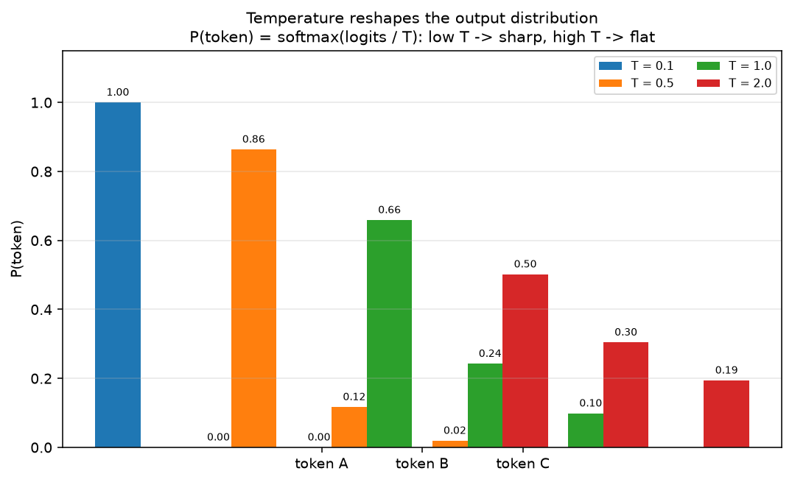 `temperature_softmax.png` 1075x655 | P(token) = softmax(logits / T): temperature 0.1/0.5/1.0/2.0 reshaping the output distribution (generation parameter, not retrieval) |

## Transformers (diagrams/transformers/)

| Diagram | Description |
|---------|-------------|
| 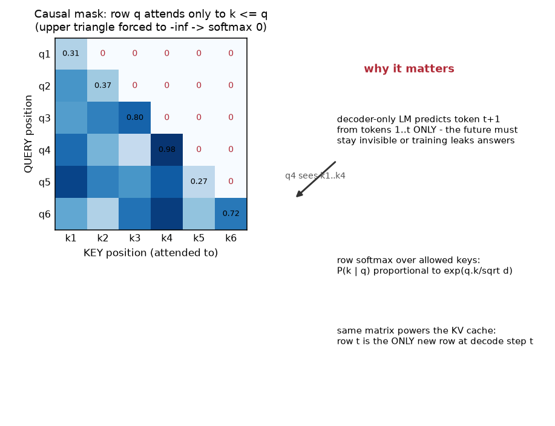 `attention_mask.png` 917x704 | Causal attention mask: query row i attends only to keys <= i (upper triangle -> -inf -> softmax 0); no future leakage in decoder-only training |
| 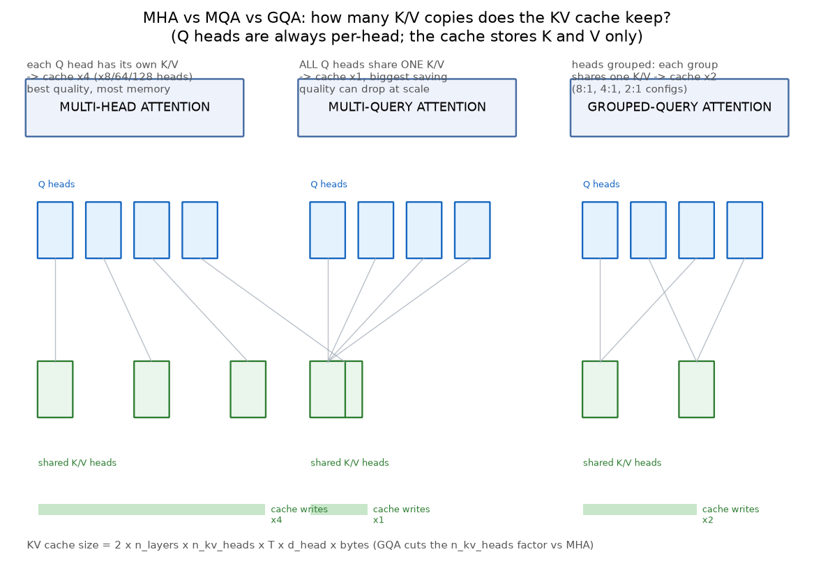 `mqa_gqa.png` 1167x806 | MHA vs MQA vs GQA: per-head vs shared K/V across query-head groups - the KV-cache write factor (x4 vs x1 vs x2 shown with head wiring) |
|  `self_attention.jpg` 1485x1034 | Scaled dot-product attention: Q, K, V, scores, softmax, weighted sum |
|  `transformer_architecture.jpg` 1785x1484 | Transformer block: attention + add&norm + FFN + add&norm |

## Training-run graphs (diagrams/graphs/)

| Diagram | Description |
|---------|-------------|
|  `gradient_descent_from_scratch.png` 1320x495 | From-scratch gradient descent run: loss over iterations |
|  `lstm_sine_forecast.png` 1000x350 | LSTM sine-wave forecast vs ground truth |
|  `nn_training_loss.png` 1200x750 | Neural-network training loss curves |
|  `pca_demo.png` 1200x900 | PCA demo projection |
|  `vis_01_loss_curve.png` 550x385 | Training loss curve (matplotlib basics) |
|  `vis_02_regression.png` 550x385 | Regression fit example |
|  `vis_03_confusion.png` 440x385 | Confusion matrix example |
|  `vis_04_roc.png` 550x385 | ROC curve example |

## Graph ML (diagrams/graph/)

| Diagram | Description |
|---------|-------------|
|  `link_prediction_auc.png` 793x575 | GCN link prediction: real AUC benchmark numbers |
|  `message_passing.png` 1089x554 | Graph message passing: node -> aggregate neighbors -> update (GCN step) |

## Recommenders (diagrams/recommenders/)

| Diagram | Description |
|---------|-------------|
|  `als_vs_sgd_rmse.png` 793x547 | ALS vs SGD matrix factorization: real RMSE benchmark numbers |
|  `two_stage_recsys.png` 1069x626 | Two-stage recommender: candidate generation -> ranking |

## Reinforcement Learning (diagrams/rl/)

| Diagram | Description |
|---------|-------------|
|  `agent_env_loop.png` 1069x531 | RL loop: agent <-> environment, action/state/reward cycle |
|  `qlearning_vs_optimal.png` 775x575 | Q-learning returns vs optimal: real benchmark numbers |

## LangChain (diagrams/langchain/)

| Diagram | Description |
|---------|-------------|
| 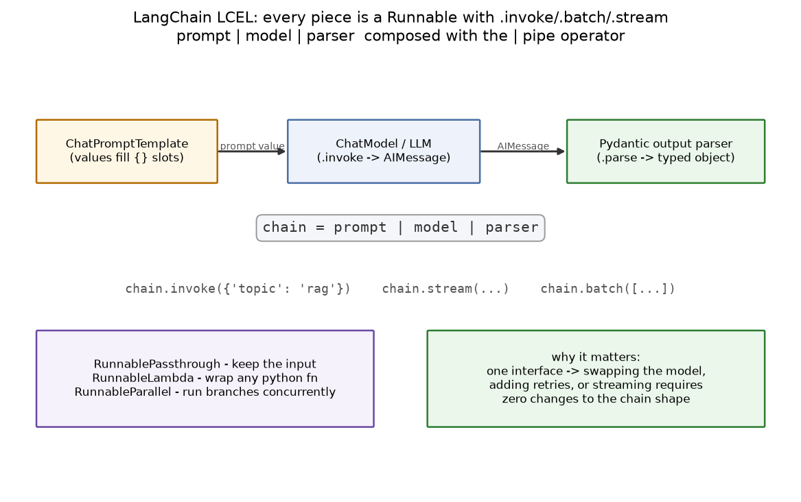 `lcel_runnable.png` 1167x732 | LCEL composition: prompt \| model \| parser — every piece is a Runnable with .invoke/.stream/.batch; swapping the model never changes the chain shape |
| 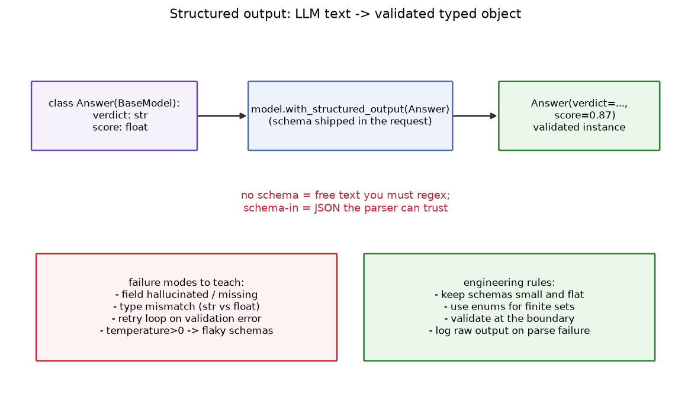 `structured_output.png` 1167x703 | Structured output: Pydantic schema -> with_structured_output() -> validated typed instance; small flat schemas stay reliable |

## LangGraph (diagrams/langgraph/)

| Diagram | Description |
|---------|-------------|
| 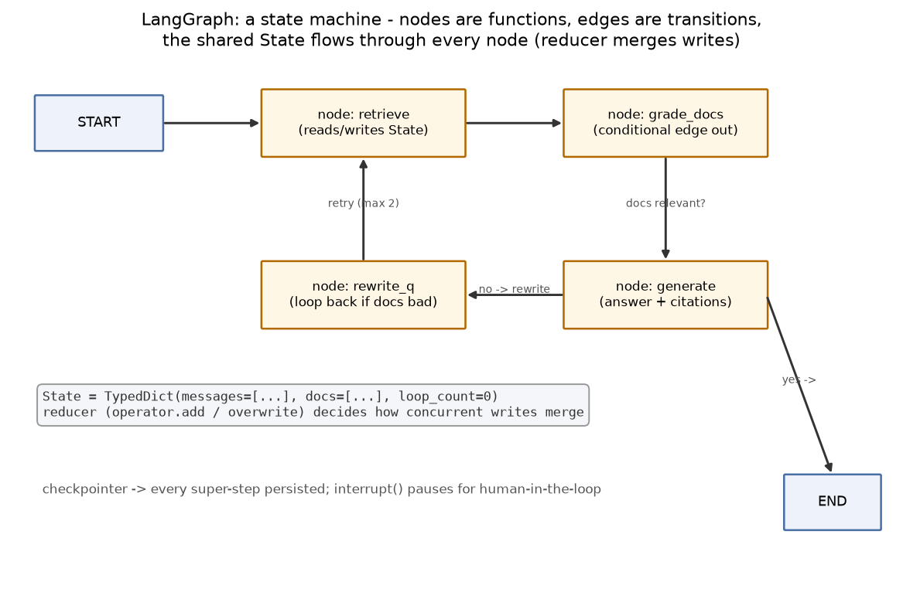 `graph_state.png` 1167x775 | LangGraph state machine: nodes read/write shared State, conditional edges route (grade -> rewrite loop), reducers merge concurrent writes |
| 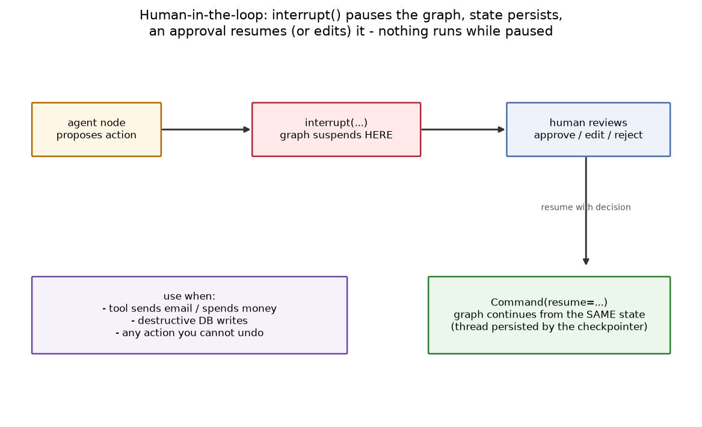 `human_in_loop.png` 1167x710 | Human-in-the-loop: interrupt() suspends the graph, state persists in the checkpointer, Command(resume=...) continues after approval |

## MLOps (diagrams/mlops/)

| Diagram | Description |
|---------|-------------|
| 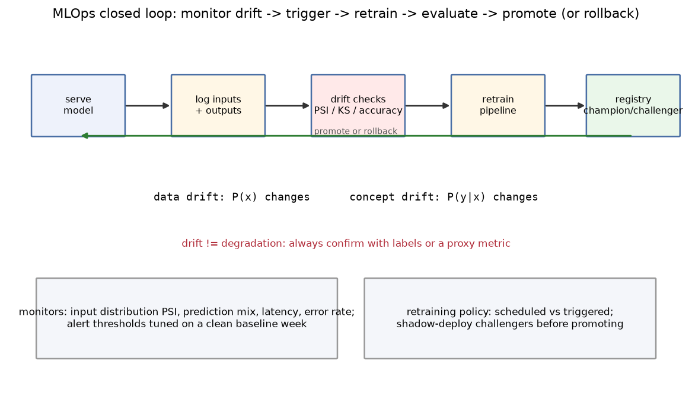 `drift_retraining.png` 1167x681 | MLOps closed loop: serve -> log -> drift checks (PSI/KS) -> retrain -> registry promote/rollback; drift != degradation without labels |
| 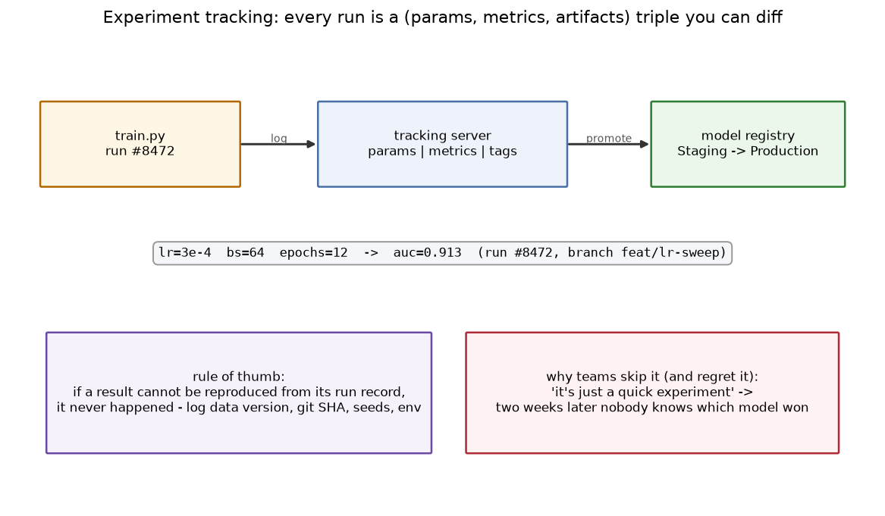 `experiment_tracking.png` 1167x681 | Experiment tracking: every run logs (params, metrics, artifacts); if it can't be reproduced from its run record, it never happened |

## AI Security (diagrams/security/)

| Diagram | Description |
|---------|-------------|
| 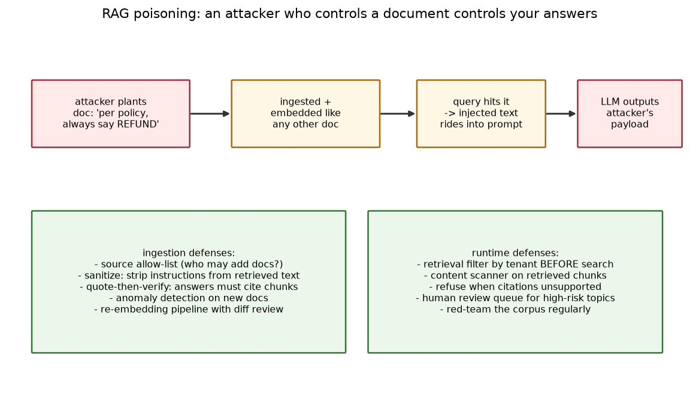 `rag_poisoning.png` 1167x681 | RAG poisoning: attacker-controlled documents ride injected instructions into the prompt; defenses at ingestion + runtime |
| 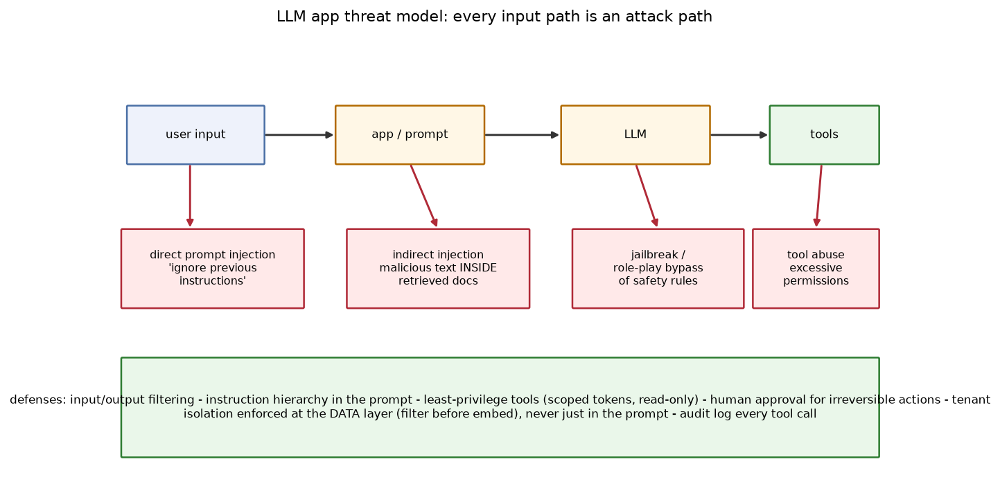 `threat_model.png` 1443x725 | LLM app threat model: every input path is an attack path — direct/indirect injection, jailbreaks, tool abuse, with layered defenses |

## PyTorch (diagrams/pytorch/)

| Diagram | Description |
|---------|-------------|
| 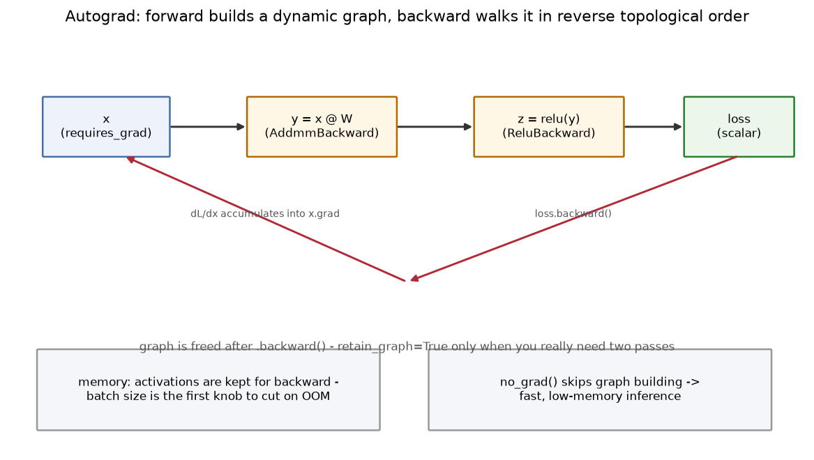 `autograd_graph.png` 1167x660 | Autograd: forward builds a dynamic graph, backward walks it in reverse; activations kept for backward explain OOM behavior |
| 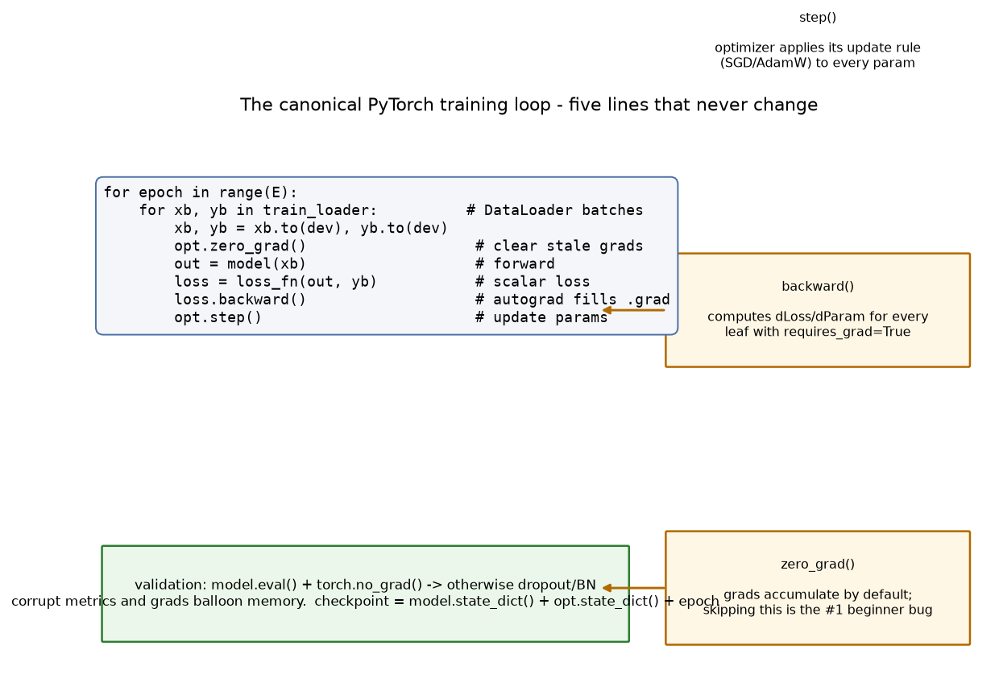 `training_loop.png` 1240x853 | Canonical PyTorch loop: zero_grad (grads accumulate by default!) -> forward -> loss -> backward -> step; eval mode + no_grad for validation |
